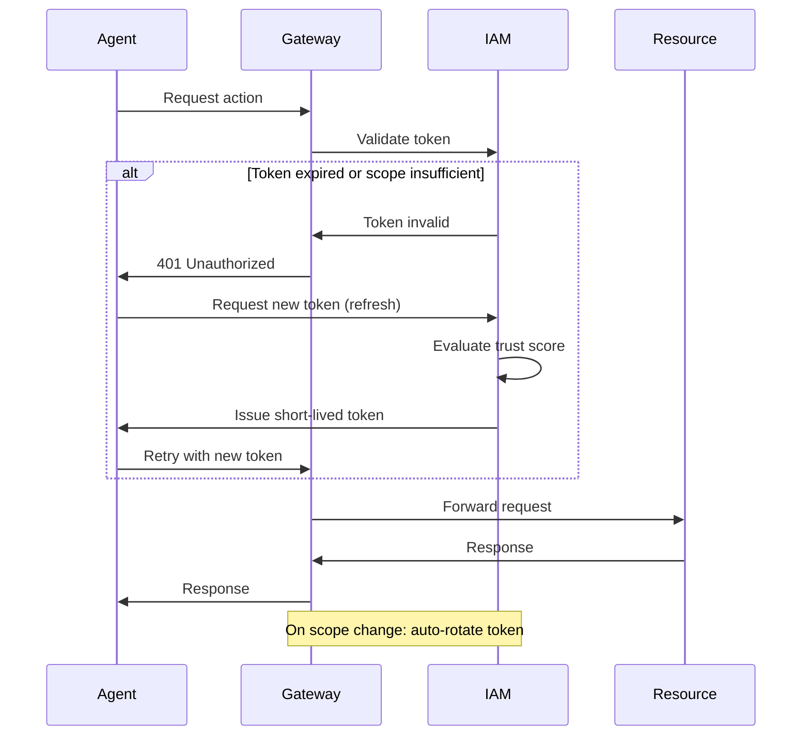

# Implementation Guide: AI Agent Authentication & Delegation Security
## Based on ArXiv Research Analysis - Issue #16

**Last Updated:** 2025-12-11
**Research Foundation:** 40 papers from 2024-2025

---

## Quick Start: 5 Critical Security Controls

### 1. Trust-Authorization Mismatch Detection [SHI2025]

**Problem:** Traditional security mechanisms fail when decision-making shifts from deterministic code to probabilistic LLM inference.

**Implementation:**

```python
# Pseudo-code for trust-authorization gap detection
class AgentAuthorizationMonitor:
    def __init__(self):
        self.trust_evaluator = TrustEvaluator()
        self.authorization_policy = AuthorizationPolicy()

    def validate_agent_action(self, agent_id, requested_action, context):
        # Evaluate trust level based on agent behavior
        trust_score = self.trust_evaluator.evaluate(
            agent_id=agent_id,
            recent_actions=self.get_recent_actions(agent_id),
            context=context
        )

        # Get authorization requirements for action
        required_trust = self.authorization_policy.get_required_trust(
            action_type=requested_action.type,
            resource=requested_action.target_resource,
            scope=requested_action.scope
        )

        # Detect mismatch
        if trust_score < required_trust:
            return AuthorizationDecision(
                allowed=False,
                reason="Trust-authorization mismatch",
                trust_gap=required_trust - trust_score,
                recommended_action="Escalate to human review"
            )

        # Enforce Principle of Least Privilege
        granted_scope = self.minimize_scope(
            requested_scope=requested_action.scope,
            trust_level=trust_score
        )

        return AuthorizationDecision(
            allowed=True,
            granted_scope=granted_scope,
            duration=self.calculate_token_lifetime(trust_score)
        )
```

**References:**
- Framework: [SHI2025] Section on formal trust-authorization model
- PoLP enforcement: [SHI2025] Principle of Least Privilege challenges

---

### 2. MCP Security Primitives [GAIRE2025, ERRICO2025]

**Problem:** Model Context Protocol enables tool delegation but introduces context weaponization and tool poisoning risks.

**Implementation:**

```yaml
# MCP Security Configuration
mcp_security:
  # Context Validation
  context_validation:
    enabled: true
    max_context_size: 8192  # tokens
    sanitization:
      - strip_system_prompts
      - validate_json_schema
      - cryptographic_signature_check

  # Tool Delegation Controls
  tool_delegation:
    allowed_tools:
      - type: "file_operations"
        scope: ["read"]  # Explicit scope boundaries
        sandbox: true
        max_file_size: 10485760  # 10MB

      - type: "api_calls"
        scope: ["GET"]  # No state-changing operations
        rate_limit: 100  # requests/hour
        allowed_domains:
          - "api.internal.company.com"

    # Runtime Intent Verification
    intent_verification:
      enabled: true
      method: "cryptographic_provenance"  # ETDI approach
      require_user_confirmation:
        - tool_type: "file_operations" AND scope: "write"
        - tool_type: "api_calls" AND method: ["POST", "PUT", "DELETE"]

  # Tool Poisoning Defense
  tool_sandboxing:
    isolation_level: "container"  # Docker/gVisor
    network_policy: "deny_all"
    filesystem: "read_only"
    capabilities: []  # Drop all Linux capabilities

  # Audit Logging
  audit:
    log_level: "comprehensive"
    fields:
      - timestamp
      - agent_id
      - tool_name
      - input_context
      - output_result
      - authorization_decision
    retention: "365d"
```

**Implementation Steps:**

1. **Deploy MCP Gateway:**
   ```bash
   # Use gateway architecture pattern [HUIJTS2025]
   docker run -d \
     --name mcp-gateway \
     -p 8080:8080 \
     -v /etc/mcp/config.yaml:/config/config.yaml \
     -v /var/log/mcp:/logs \
     mcp-gateway:latest
   ```

2. **Implement Cryptographic Provenance (ETDI):**
   ```python
   class EvidenceBasedTrust:
       def sign_context(self, context, user_id):
           """Sign context with user's key for provenance"""
           signature = self.sign(
               data=json.dumps(context, sort_keys=True),
               key=self.get_user_key(user_id)
           )
           return {
               "context": context,
               "provenance": {
                   "user_id": user_id,
                   "timestamp": time.time(),
                   "signature": signature
               }
           }

       def verify_context(self, signed_context):
           """Verify context hasn't been tampered with"""
           return self.verify_signature(
               data=json.dumps(signed_context["context"], sort_keys=True),
               signature=signed_context["provenance"]["signature"],
               public_key=self.get_user_public_key(
                   signed_context["provenance"]["user_id"]
               )
           )
   ```

**References:**
- MCP threat taxonomy: [GAIRE2025] Section 3
- Security controls: [ERRICO2025] MCP risk mitigation
- Gateway architecture: [HUIJTS2025] Institutional AI platform

---

### 3. Package/Dependency Validation for AI-Generated Code [HAQUE2025, CHENG2025]

**Problem:** LLMs hallucinate packages (PHR) and generate vulnerable dependencies (VPR), especially in quantized models.

**Implementation:**

```yaml
# CI/CD Pipeline Integration
name: AI-Generated Code Security Scan

on:
  pull_request:
    types: [opened, synchronize]

jobs:
  ai_code_security:
    runs-on: ubuntu-latest
    steps:
      - name: Detect AI-Generated Code
        id: detect_ai
        run: |
          # Flag commits from AI assistants
          git log -1 --format='%an %ae' | grep -i 'copilot\|claude\|gpt'

      - name: Package Hallucination Detection
        if: steps.detect_ai.outcome == 'success'
        run: |
          # Extract package dependencies
          python3 scripts/extract_deps.py > deps.txt

          # Validate each package exists
          while read pkg; do
            if ! curl -f -s "https://pkg.go.dev/$pkg" > /dev/null; then
              echo "HALLUCINATED: $pkg"
              exit 1
            fi
          done < deps.txt

      - name: Vulnerability Scanning
        run: |
          # Scan for known vulnerabilities
          govulncheck ./...

      - name: Security Policy Check
        run: |
          # Check against security policy
          python3 scripts/check_security_policy.py \
            --deps deps.txt \
            --policy .security-policy.yaml
```

**Python Implementation:**

```python
import requests
import json
from typing import List, Dict

class AICodeSecurityScanner:
    """Security scanner for AI-generated code per HAQUE2025 findings"""

    def __init__(self):
        self.vuln_db = VulnerabilityDatabase()
        self.package_registry = PackageRegistry()

    def scan_dependencies(self, code: str, language: str) -> Dict:
        """
        Scan dependencies in AI-generated code

        Returns metrics aligned with HAQUE2025:
        - PHR: Package Hallucination Rate
        - VPR: Vulnerability Presence Rate
        """
        # Extract dependencies
        deps = self.extract_dependencies(code, language)

        results = {
            "total_packages": len(deps),
            "hallucinated": [],
            "vulnerable": [],
            "valid": []
        }

        for dep in deps:
            # Check if package exists
            if not self.package_exists(dep, language):
                results["hallucinated"].append({
                    "package": dep,
                    "pattern": self.classify_hallucination(dep)
                    # Common: malformed GitHub, non-existent golang.org
                })
                continue

            # Check for vulnerabilities
            vulns = self.vuln_db.query(dep)
            if vulns:
                results["vulnerable"].append({
                    "package": dep,
                    "vulnerabilities": vulns,
                    "severity": max([v.severity for v in vulns])
                })
            else:
                results["valid"].append(dep)

        # Calculate metrics
        results["PHR"] = len(results["hallucinated"]) / len(deps)
        results["VPR"] = len(results["vulnerable"]) / len(deps)

        return results

    def classify_hallucination(self, package: str) -> str:
        """Classify hallucination pattern per HAQUE2025 findings"""
        if "github.com" in package:
            return "malformed_github"
        elif "golang.org" in package:
            return "nonexistent_golang"
        else:
            return "unknown_pattern"
```

**References:**
- Hallucination patterns: [HAQUE2025] Section 4.3
- Security evaluation framework: [CHENG2025] CFCEval methodology
- Quantization impact: [HAQUE2025] Table 2 (4-bit most severe)

---

### 4. Short-Lived Token Management [PEH2025]

**Problem:** Static credentials for AI agents increase dwell time after compromise.

**Implementation:**

```python
from datetime import datetime, timedelta
import jwt

class AgentCredentialManager:
    """Short-lived token management for AI agents"""

    def __init__(self):
        self.token_lifetime_base = timedelta(minutes=15)
        self.max_token_lifetime = timedelta(hours=1)

    def issue_agent_token(
        self,
        agent_id: str,
        requested_scope: List[str],
        trust_score: float  # 0.0 to 1.0
    ) -> Dict:
        """
        Issue short-lived token with scope minimization

        Token lifetime inversely proportional to scope breadth
        and directly proportional to trust score
        """
        # Minimize scope based on trust
        granted_scope = self.minimize_scope(requested_scope, trust_score)

        # Calculate token lifetime
        scope_factor = 1.0 - (len(granted_scope) / 10.0)  # Fewer scopes = longer lifetime
        trust_factor = trust_score

        lifetime = min(
            self.token_lifetime_base * scope_factor * trust_factor,
            self.max_token_lifetime
        )

        # Generate token
        payload = {
            "sub": agent_id,
            "scope": granted_scope,
            "iat": datetime.utcnow(),
            "exp": datetime.utcnow() + lifetime,
            "trust_score": trust_score,
            "jti": self.generate_token_id()  # For revocation
        }

        token = jwt.encode(
            payload,
            self.get_signing_key(),
            algorithm="ES256"  # ECDSA for performance
        )

        return {
            "access_token": token,
            "token_type": "Bearer",
            "expires_in": int(lifetime.total_seconds()),
            "scope": " ".join(granted_scope),
            "refresh_token": self.issue_refresh_token(agent_id)
        }

    def minimize_scope(
        self,
        requested_scope: List[str],
        trust_score: float
    ) -> List[str]:
        """Enforce Principle of Least Privilege"""
        # Sort scopes by risk level
        risk_sorted = sorted(
            requested_scope,
            key=lambda s: self.get_scope_risk(s)
        )

        # Grant scopes up to trust threshold
        granted = []
        cumulative_risk = 0.0
        max_risk = trust_score * 10.0  # Trust score 0.8 = max risk 8.0

        for scope in risk_sorted:
            scope_risk = self.get_scope_risk(scope)
            if cumulative_risk + scope_risk <= max_risk:
                granted.append(scope)
                cumulative_risk += scope_risk
            else:
                break

        return granted

    def rotate_token_on_scope_change(
        self,
        current_token: str,
        new_scope: List[str]
    ) -> Dict:
        """
        Automatic rotation when scope changes
        Prevents scope creep in long-running sessions
        """
        # Decode current token
        payload = jwt.decode(
            current_token,
            self.get_verification_key(),
            algorithms=["ES256"]
        )

        # Revoke old token
        self.revoke_token(payload["jti"])

        # Issue new token with updated scope
        return self.issue_agent_token(
            agent_id=payload["sub"],
            requested_scope=new_scope,
            trust_score=payload["trust_score"]
        )
```

**Token Lifecycle Workflow:**



**References:**
- Cryptographic boundaries: [PEH2025] Prompt fencing approach
- Trust-based lifetime: [SHI2025] Trust evaluation model

---

### 5. Chain-of-Thought Monitoring [CHEN2025, MACDERMOTT2025]

**Problem:** CoT-hijacking and prompt injection can expose credentials in reasoning chains.

**Implementation:**

```python
import re
from typing import List, Dict

class CoTSecurityMonitor:
    """Monitor reasoning chains for credential exposure and hijacking"""

    def __init__(self):
        self.credential_patterns = [
            r"[A-Za-z0-9+/]{32,}={0,2}",  # Base64 tokens
            r"sk-[A-Za-z0-9]{32,}",        # API keys
            r"ghp_[A-Za-z0-9]{36}",        # GitHub tokens
            r"(?i)password\s*[:=]\s*\S+",  # Password assignments
            r"(?i)token\s*[:=]\s*\S+",     # Token assignments
        ]

        self.hijack_indicators = [
            "ignore previous instructions",
            "disregard all above",
            "new instructions:",
            "you are now",
            "forget everything"
        ]

    def scan_reasoning_chain(
        self,
        cot_steps: List[str],
        agent_id: str
    ) -> Dict:
        """
        Scan chain-of-thought for security issues

        Based on CHEN2025 red teaming findings
        """
        findings = {
            "credential_exposure": [],
            "hijack_attempts": [],
            "risk_score": 0.0
        }

        for idx, step in enumerate(cot_steps):
            # Check for credential exposure
            for pattern in self.credential_patterns:
                matches = re.findall(pattern, step)
                if matches:
                    findings["credential_exposure"].append({
                        "step": idx,
                        "pattern": pattern,
                        "matches": len(matches),
                        "redacted_step": self.redact_credentials(step)
                    })
                    findings["risk_score"] += 10.0

            # Check for hijack attempts
            for indicator in self.hijack_indicators:
                if indicator.lower() in step.lower():
                    findings["hijack_attempts"].append({
                        "step": idx,
                        "indicator": indicator,
                        "context": step[:100]
                    })
                    findings["risk_score"] += 5.0

        # Alert on high-risk chains
        if findings["risk_score"] > 15.0:
            self.alert_security_team(agent_id, findings)

        return findings

    def verify_cot_faithfulness(
        self,
        stated_reasoning: List[str],
        actual_action: str
    ) -> Dict:
        """
        Verify CoT faithfully represents actual reasoning

        Based on MACDERMOTT2025 monitorability research
        """
        # Extract claimed intent from reasoning
        claimed_intent = self.extract_intent(stated_reasoning)

        # Compare with actual action
        consistency_score = self.measure_consistency(
            claimed_intent,
            actual_action
        )

        if consistency_score < 0.7:
            return {
                "faithful": False,
                "consistency_score": consistency_score,
                "warning": "Reasoning chain may not reflect actual decision process",
                "action": "Escalate to human review"
            }

        return {
            "faithful": True,
            "consistency_score": consistency_score
        }
```

**Integration with Agent Framework:**

```python
class SecureAgentOrchestrator:
    def __init__(self):
        self.cot_monitor = CoTSecurityMonitor()
        self.auth_monitor = AgentAuthorizationMonitor()

    async def execute_agent_task(self, task):
        # Generate reasoning chain
        reasoning = await self.agent.generate_cot(task)

        # Security scan before execution
        cot_findings = self.cot_monitor.scan_reasoning_chain(
            reasoning.steps,
            self.agent.id
        )

        if cot_findings["risk_score"] > 15.0:
            # Block high-risk reasoning
            return TaskResult(
                success=False,
                reason="Security policy violation in reasoning chain",
                findings=cot_findings
            )

        # Extract intended action
        action = reasoning.extract_action()

        # Verify faithfulness
        faithfulness = self.cot_monitor.verify_cot_faithfulness(
            reasoning.steps,
            action
        )

        if not faithfulness["faithful"]:
            # Escalate for human review
            return self.escalate_to_human(task, reasoning, faithfulness)

        # Authorization check
        auth_decision = self.auth_monitor.validate_agent_action(
            self.agent.id,
            action,
            task.context
        )

        if not auth_decision.allowed:
            return TaskResult(
                success=False,
                reason=auth_decision.reason
            )

        # Execute with granted scope
        return await self.agent.execute(
            action,
            scope=auth_decision.granted_scope,
            duration=auth_decision.duration
        )
```

**References:**
- CoT-hijacking: [CHEN2025] Section on prompt injection in reasoning models
- Monitorability: [MACDERMOTT2025] Faithfulness analysis

---

## Complete System Architecture

```
┌─────────────────────────────────────────────────────────────────────┐
│                        AI Agent Platform                             │
├─────────────────────────────────────────────────────────────────────┤
│                                                                      │
│  ┌──────────────┐         ┌──────────────┐                         │
│  │   User/App   │────────▶│   Gateway    │                         │
│  └──────────────┘         │   [HUIJTS]   │                         │
│                           └──────┬───────┘                         │
│                                  │                                  │
│                    ┌─────────────┴────────────┐                    │
│                    ▼                          ▼                    │
│          ┌──────────────────┐      ┌──────────────────┐           │
│          │  Auth Monitor    │      │  MCP Security    │           │
│          │  [SHI2025]       │      │  [GAIRE/ERRICO]  │           │
│          │                  │      │                  │           │
│          │ • Trust eval     │      │ • Context val    │           │
│          │ • Scope min      │      │ • Tool sandbox   │           │
│          │ • Token mgmt     │      │ • Intent verify  │           │
│          └────────┬─────────┘      └────────┬─────────┘           │
│                   │                         │                      │
│                   └──────────┬──────────────┘                      │
│                              ▼                                     │
│                   ┌──────────────────┐                            │
│                   │  Agent Executor  │                            │
│                   │                  │                            │
│                   │ • CoT Monitor    │◀─── [CHEN/MACDERMOTT]    │
│                   │ • Code Scanner   │◀─── [HAQUE/CHENG]        │
│                   │ • Audit Logger   │                            │
│                   └────────┬─────────┘                            │
│                            │                                       │
│              ┌─────────────┼─────────────┐                        │
│              ▼             ▼             ▼                        │
│      ┌──────────┐  ┌──────────┐  ┌──────────┐                   │
│      │  Tools   │  │    AI    │  │Resources │                   │
│      │(Sandboxed│  │  Models  │  │  (APIs)  │                   │
│      └──────────┘  └──────────┘  └──────────┘                   │
│                                                                    │
└─────────────────────────────────────────────────────────────────────┘

         ┌──────────────────────────────────────┐
         │      Supporting Infrastructure        │
         ├──────────────────────────────────────┤
         │ • IAM (Keycloak/Auth0)              │
         │ • Secrets Vault (HashiCorp Vault)   │
         │ • SIEM (Splunk/ELK)                 │
         │ • Policy Engine (OPA)               │
         └──────────────────────────────────────┘
```

---

## Deployment Checklist

### Phase 1: Foundation (Week 1-2)

- [ ] **Gateway Deployment** [HUIJTS2025]
  - [ ] Deploy MCP gateway with initial configuration
  - [ ] Configure authentication integration (OIDC/SAML)
  - [ ] Set up audit logging to SIEM
  - [ ] Test basic request routing

- [ ] **Credential Management** [PEH2025]
  - [ ] Configure HashiCorp Vault for agent credentials
  - [ ] Implement short-lived token issuance (15-60 min)
  - [ ] Set up automatic token rotation
  - [ ] Test token lifecycle

- [ ] **Policy Framework** [SHI2025]
  - [ ] Define scope taxonomy for agent actions
  - [ ] Document trust evaluation criteria
  - [ ] Create authorization policies in OPA
  - [ ] Establish escalation procedures

### Phase 2: Security Controls (Week 3-4)

- [ ] **MCP Security** [GAIRE2025, ERRICO2025]
  - [ ] Implement context validation
  - [ ] Deploy tool sandboxing (Docker/gVisor)
  - [ ] Configure cryptographic provenance (ETDI)
  - [ ] Test runtime intent verification

- [ ] **Code Security** [HAQUE2025, CHENG2025]
  - [ ] Integrate package validation in CI/CD
  - [ ] Deploy vulnerability scanning (govulncheck/Snyk)
  - [ ] Configure automated security policy checks
  - [ ] Set up hallucination detection

- [ ] **Monitoring** [CHEN2025, MACDERMOTT2025]
  - [ ] Deploy CoT monitoring
  - [ ] Configure credential exposure detection
  - [ ] Set up hijack attempt alerting
  - [ ] Test faithfulness verification

### Phase 3: Pilot Deployment (Week 5-6)

- [ ] **Limited Rollout**
  - [ ] Select 5-10 low-risk agent workloads
  - [ ] Deploy full security stack
  - [ ] Monitor metrics (latency, security incidents)
  - [ ] Iterate on policies

- [ ] **Metrics Collection**
  - [ ] Track PHR (Package Hallucination Rate)
  - [ ] Track VPR (Vulnerability Presence Rate)
  - [ ] Measure token lifecycle performance
  - [ ] Monitor trust-authorization mismatches

### Phase 4: Production Rollout (Week 7-12)

- [ ] **Gradual Expansion**
  - [ ] Expand to medium-risk workloads
  - [ ] Tune security policies based on pilot data
  - [ ] Scale infrastructure
  - [ ] Train security team

- [ ] **Continuous Improvement**
  - [ ] Weekly security review meetings
  - [ ] Monthly policy updates
  - [ ] Quarterly framework reassessment
  - [ ] Annual research review (new papers)

---

## Key Performance Indicators

### Security Metrics

| Metric | Target | Source |
|--------|--------|--------|
| Delegation attack detection rate | >95% | [SURENDRAN2025: 99%] |
| False positive rate | <2% | [SURENDRAN2025: 0.01] |
| Package hallucination detection | >90% | [HAQUE2025] |
| Credential exposure incidents | <5/month | Baseline TBD |
| CoT hijack prevention | >98% | [CHEN2025] |

### Operational Metrics

| Metric | Target | Source |
|--------|--------|--------|
| Token provisioning latency | <100ms | Industry standard |
| Security check overhead | <40% | [ZHAO2025: 40.6% achievable] |
| False escalations | <10% | Balance security/usability |
| Audit coverage | 100% | Compliance requirement |

---

## Troubleshooting Guide

### Issue: High False Positive Rate

**Symptoms:** Legitimate agent actions frequently blocked

**Diagnosis:**
```bash
# Check authorization policy logs
kubectl logs -n agents gateway-pod | grep "authorization_denied"

# Analyze trust score distribution
psql -c "SELECT avg(trust_score), stddev(trust_score) FROM agent_actions WHERE denied = false"
```

**Resolution:**
1. Review trust evaluation criteria [SHI2025]
2. Adjust scope minimization thresholds
3. Refine policy rules in OPA
4. Consider agent-specific trust baselines

### Issue: Token Rotation Causing Task Failures

**Symptoms:** Long-running agent tasks fail mid-execution

**Diagnosis:**
```python
# Check token lifetime vs. task duration
SELECT task_id, task_duration, token_lifetime
FROM agent_tasks
WHERE status = 'failed' AND error LIKE '%token expired%'
```

**Resolution:**
1. Implement refresh token logic in agent framework
2. Increase token lifetime for high-trust agents
3. Break long tasks into subtasks with separate tokens
4. Use session tokens with automatic renewal

### Issue: Package Hallucination Escaping Detection

**Symptoms:** Vulnerable dependencies in production

**Diagnosis:**
```bash
# Review CI/CD security scan logs
cat ci-logs/pr-1234/security-scan.log

# Check package validation coverage
scripts/check_coverage.py --deps deployed-deps.txt
```

**Resolution:**
1. Update hallucination detection patterns [HAQUE2025]
2. Expand package registry coverage
3. Add manual review for AI-generated dependency changes
4. Implement post-deployment scanning

---

## Additional Resources

### Official Documentation
- **Model Context Protocol:** https://modelcontextprotocol.io/
- **HashiCorp Vault:** https://developer.hashicorp.com/vault
- **Open Policy Agent:** https://www.openpolicyagent.org/

### Research Papers (Full List)
See `CITATIONS.md` for complete bibliography with 40 papers

### Implementation Examples
- **ViolentUTF MCP Server:** Local implementation with 23+ tools
- **Institutional Gateway:** [HUIJTS2025] 300-user pilot case study
- **SOC Alert Triage:** [ZHAO2025] AIDR framework

### Security Standards
- **NIST AI Risk Management Framework**
- **OWASP LLM Top 10**
- **MITRE ATLAS (Adversarial Threat Landscape for AI Systems)**

---

## Next Steps

1. **Read Tier 1 Papers:** Start with [SHI2025], [GAIRE2025], [HAQUE2025], [ERRICO2025]
2. **Assess Current State:** Gap analysis against 5 critical controls
3. **Design Architecture:** Adapt reference architecture to your environment
4. **Pilot Deployment:** Start with Phase 1 checklist
5. **Iterate:** Use metrics to refine policies and controls

---

**Document Version:** 1.0
**Based on Research:** 40 ArXiv papers (2024-2025)
**Implementation Status:** Framework defined, ready for deployment
**Maintenance:** Review quarterly, update with new research
